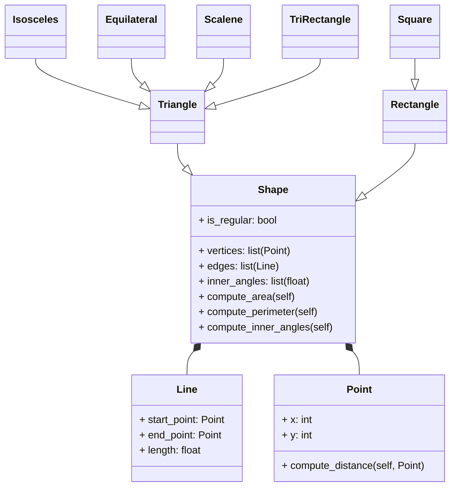

# Challenge #3 POO

### I´m Alejandro Bello Leon from "Fenomenoides" team, i attach our logo: 

<details><summary>Get ready to see the great logo: </summary><p>
<div align='center'>
<figure> </br>
<figcaption><b> "we are programmers, not designers" </b></figcaption></figure>
</div>
</p></details><br>

Below is the solution proposed to the challenge:

#### 1. Excercise proposed in class
1.1. Create a superclass called Shape(), which is the base of the classes Reactangle() and Square(), define the methods compute_area and compute_perimeter in Shape() and then using polymorphism redefine the methods properly in Rectangle and in Square.

```python

import math

class Point:
  def __init__(self, x: float, y: float):
    self.x = x
    self.y = y

class Line:
  def __init__(self, start: Point, end: Point):
    self.start = start
    self.end = end

  def compute_length(self):
    dx = self.start.x - self.end.x
    dy = self.start.y - self.end.y
    return ((dx**2 + dy**2)**0.5)
  
  def compute_slope(self):
    dx = abs(self.start.x - self.end.x)
    dy = abs(self.start.y - self.end.y)
    return(f"The slope of the line with the x axis is {math.degrees(math.atan2(dy, dx))}°")

  def compute_horizontal_cross(self):
    point1 = self.start.y
    point2 = self.end.y
    return(f"Cross with x axis: {point1 * point2 < 0}")  
    
  def compute_vertical_cross(self):
    point1 = self.start.x
    point2 = self.end.x
    return(f"cross with y axis: {point1 * point2 < 0}")
  
  def dicretize_line(self, size):
    points = []
    scalex = 0
    scaley = 0
    dx = (self.end.x - self.start.x) / (size)
    dy = (self.end.y - self.start.y) / (size)
    for i in range(size):
      scalex += dx
      scaley += dy
      points.append((self.end.x - scalex, self.end.y - scaley))
    return points

class Shape:
  def __init__(self):
    pass

  def compute_area(self):
    ...
  
  def compute_perimeter(self):
    ...

class Rectangle(Shape):
  def __init__(self, width1: Line, height1: Line, width2: Line, height2: Line):
    super().__init__()
    self.width1 = width1
    self.height1 = height1
    self.width2 = width2
    self.height2 = height2

  def compute_area(self):
    return self.width1.compute_length() * self.height1.compute_length()
  
  def compute_perimeter(self):
    return (2 * self.height1.compute_length()) + (2 * self.width1.compute_length())
  
class Square(Shape):
  def __init__(self, width1: Line, height1: Line, width2: Line, height2: Line):
    super().__init__()
    self.width1 = width1
    self.height1 = height1
    self.width2 = width2
    self.height2 = height2
  
  def compute_area(self):
    return self.width1.compute_length() ** 2 
  
  def compute_perimeter(self):
    return 4 * self.width1.compute_length()

```

Then, the exampĺe in the main:

```python

if __name__ == "__main__":

  #* RECTANGLE
  # First Line
  start1 = Point(0,0)
  end1 = Point(0,5)
  line1 = Line(start1, end1)

  # Second line
  start2 = Point(0,0)
  end2 = Point(4,0)
  line2 = Line(start2, end2)

  # Third line
  start3 = Point(4,0)
  end3 = Point(4,5)
  line3 = Line(start3, end3)

  # fourth line
  start4 = Point(0,5)
  end4 = Point(4,5)
  line4 = Line(start4, end4)

  rectangle1 = Rectangle(line1, line2, line3, line4)
  print(rectangle1.compute_area())
  print(rectangle1.compute_perimeter())  
  
  
  #* SQUARE
  # First Line
  start1 = Point(0,0)
  end1 = Point(0,5)
  line1 = Line(start1, end1)

  # Second line
  start2 = Point(0,0)
  end2 = Point(5,0)
  line2 = Line(start2, end2)

  # Third line
  start3 = Point(5,0)
  end3 = Point(5,5)
  line3 = Line(start3, end3)

  # fourth line
  start4 = Point(0,5)
  end4 = Point(5,5)
  line4 = Line(start4, end4)

  square1 = Square(line1, line2, line3, line4)
  print(square1.compute_area())
  print(square1.compute_perimeter())
```

1.2. Using the classes Point() and Line() define a new super-class Shape() with the following structure:



Using the builded class `Point` and `Line`, i constructed the superclass `Shape`; inheriting the types of triangles and rectangles:

```python
import math

class Point:
  def __init__(self, x: float, y: float):
    self.x = x
    self.y = y

class Line:
  def __init__(self, start: Point, end: Point):
    self.start = start
    self.end = end

  def compute_length(self):
    dx = self.start.x - self.end.x
    dy = self.start.y - self.end.y
    return ((dx**2 + dy**2)**0.5)
  
  def compute_slope(self):
    dx = abs(self.start.x - self.end.x)
    dy = abs(self.start.y - self.end.y)
    return(f"The slope of the line with the x axis is {math.degrees(math.atan2(dy, dx))}°")

  def compute_horizontal_cross(self):
    point1 = self.start.y
    point2 = self.end.y
    return(f"Cross with x axis: {point1 * point2 < 0}")  
    
  def compute_vertical_cross(self):
    point1 = self.start.x
    point2 = self.end.x
    return(f"cross with y axis: {point1 * point2 < 0}")
  
  def dicretize_line(self, size):
    points = []
    scalex = 0
    scaley = 0
    dx = (self.end.x - self.start.x) / (size)
    dy = (self.end.y - self.start.y) / (size)
    for i in range(size):
      scalex += dx
      scaley += dy
      points.append((self.end.x - scalex, self.end.y - scaley))
    return points

class Shape:
  def __init__(self):
    pass

  def compute_area(self):
    ...
  
  def compute_perimeter(self):
    ...

class Rectangle(Shape):
  def __init__(self, width1: Line, height1: Line, width2: Line, height2: Line):
    super().__init__()
    self.width1 = width1
    self.height1 = height1
    self.width2 = width2
    self.height2 = height2

  def compute_area(self):
    return self.width1.compute_length() * self.height1.compute_length()
  
  def compute_perimeter(self):
    return (2 * self.height1.compute_length()) + (2 * self.width1.compute_length())
  
class Square(Shape):
  def __init__(self, width1: Line, height1: Line, width2: Line, height2: Line):
    super().__init__()
    self.width1 = width1
    self.height1 = height1
    self.width2 = width2
    self.height2 = height2
  
  def compute_area(self):
    return self.width1.compute_length() ** 2 
  
  def compute_perimeter(self):
    return 4 * self.width1.compute_length()
  
class Triangle(Shape):
  def __init__(self, side1: Line, side2: Line, side3: Line):
    super().__init__()
    self.side1 = side1
    self.side2 = side2
    self.side3 = side3

  def compute_area(self):
    ...
  
  def compute_perimeter(self):
    ...

class IsocelesTriangle(Triangle):
  def __init__(self, base: Line, height: Line, side1: Line, side2: Line):
    super().__init__(side1, side2, height)
    self.base = base
    self.height = height

  def compute_area(self):
    return (self.base.compute_length() * self.height.compute_length()) / 2
  
  def compute_perimeter(self):
    return self.base.compute_length() + (2 * self.side1.compute_length())

class EquilateralTriangle(Triangle):
  def __init__(self, side1: Line, side2: Line, side3: Line):
    super().__init__(side1, side2, side3)

  def compute_area(self):
    return (self.side1.compute_length() ** 2 * (3 ** 0.5)) / 4
  
  def compute_perimeter(self):
    return 3 * self.side1.compute_length()
  
class RectangleTriangle(Triangle):
  def __init__(self, side1: Line, side2: Line, side3: Line):
    super().__init__(side1, side2, side3)

  def compute_area(self):
    return (self.side1.compute_length() * self.side2.compute_length()) / 2
  
  def compute_perimeter(self):
    return self.side1.compute_length() + self.side2.compute_length() + self.side3.compute_length()
  
class ScaleneTriangle(Triangle):
  def __init__(self, side1: Line, side2: Line, side3: Line):
    super().__init__(side1, side2, side3)

  def compute_area(self):
    s = (self.side1.compute_length() + self.side2.compute_length() + self.side3.compute_length()) / 2
    return (s * (s - self.side1.compute_length()) * (s - self.side2.compute_length()) * (s - self.side3.compute_length())) ** 0.5
  
  def compute_perimeter(self):
    return self.side1.compute_length() + self.side2.compute_length() + self.side3.compute_length()
```

the usage example:

```python
if __name__ == "__main__":
  #* RECTANGLE
  start1 = Point(0, 0)
  end1 = Point(0, 5)
  line1 = Line(start1, end1)
  start2 = Point(0, 0)
  end2 = Point(4, 0)
  line2 = Line(start2, end2)
  start3 = Point(4, 0)
  end3 = Point(4, 5)
  line3 = Line(start3, end3)
  start4 = Point(0, 5)
  end4 = Point(4, 5)
  line4 = Line(start4, end4)
  rectangle1 = Rectangle(line1, line2, line3, line4)
  print("Área del rectángulo:", rectangle1.compute_area())
  print("Perímetro del rectángulo:", rectangle1.compute_perimeter())

  #* SQUARE
  start1 = Point(0, 0)
  end1 = Point(0, 5)
  line1 = Line(start1, end1)
  start2 = Point(0, 0)
  end2 = Point(5, 0)
  line2 = Line(start2, end2)
  start3 = Point(5, 0)
  end3 = Point(5, 5)
  line3 = Line(start3, end3)
  start4 = Point(0, 5)
  end4 = Point(5, 5)
  line4 = Line(start4, end4)
  square1 = Square(line1, line2, line3, line4)
  print("Área del cuadrado:", square1.compute_area())
  print("Perímetro del cuadrado:", square1.compute_perimeter())

  #* ISOSCELES TRIANGLE
  base = Line(Point(-2, 0), Point(2, 0))
  side1 = Line(Point(-2, 0), Point(0, 3))
  side2 = Line(Point(2, 0), Point(0, 3))
  height = Line(Point(0, 3), Point(0, 0))  # Altura perpendicular
  isosceles_triangle = IsocelesTriangle(base, height, side1, side2)
  print("Área del triángulo isósceles:", isosceles_triangle.compute_area())
  print("Perímetro del triángulo isósceles:", isosceles_triangle.compute_perimeter())

  #* EQUILATERAL TRIANGLE
  side1 = Line(Point(0, 0), Point(3, 0))
  side2 = Line(Point(3, 0), Point(1.5, 2.598))
  side3 = Line(Point(1.5, 2.598), Point(0, 0))
  equilateral_triangle = EquilateralTriangle(side1, side2, side3)
  print("Área del triángulo equilátero:", equilateral_triangle.compute_area())
  print("Perímetro del triángulo equilátero:", equilateral_triangle.compute_perimeter())

  #* RECTANGLE TRIANGLE
  side1 = Line(Point(0, 0), Point(3, 0))  # Base
  side2 = Line(Point(3, 0), Point(3, 4))  # Altura
  side3 = Line(Point(0, 0), Point(3, 4))  # Hipotenusa
  rectangle_triangle = RectangleTriangle(side1, side2, side3)
  print("Área del triángulo rectángulo:", rectangle_triangle.compute_area())
  print("Perímetro del triángulo rectángulo:", rectangle_triangle.compute_perimeter())

  #* SCALENE TRIANGLE
  side1 = Line(Point(0, 0), Point(3, 0))
  side2 = Line(Point(3, 0), Point(2, 4))
  side3 = Line(Point(2, 4), Point(0, 0))
  scalene_triangle = ScaleneTriangle(side1, side2, side3)
  print("Área del triángulo escaleno:", scalene_triangle.compute_area())
  print("Perímetro del triángulo escaleno:", scalene_triangle.compute_perimeter())
```
#### 2. The restaurant revisted
The final version of the restaurant, with `encapsulation principle`

```python
class MenuItem:
  """
  base class that define general parameters for each item from menu

  Attributes:
    name (str): Name of the item from menu
    price (float): Price of the item from menu
  """
  def __init__(self, name: str, price: float):
    """
  Initializes the class with values for name and price.

  Args:
    name (str): The initial value for name.
    price (int): The initial value for price.
    """
    self.name = name
    self.price = price
 
class Beverage(MenuItem):
  """
  A subclass of MenuItem that represent Beverage

  Inherits:
    MenuItem: The base class

  Aditional Atributes:
    Size: The size of the beverage
  """

  def __init__(self, name, price, size: str):
    super().__init__(name, price)
    self.size = size

class Appetizer(MenuItem):
  """
  A subclass of MenuItem that represent Appetizer

  Inherits:
    MenuItem: The base class

  Aditional Atributes:
    is_vegetarian: If the food is vegetarian or not
  """
  
  def __init__(self, name, price, is_vegetarian: bool = False):
    super().__init__(name, price)
    self.is_vegetarian = is_vegetarian

class MainCourse(MenuItem):
  """
  A subclass of MenuItem that represent Beverage

  Inherits:
    MenuItem: The base class

  Aditional Atributes:
    Protein: The protein of the maincourse
    is_vegetarian: If the food is vegetarian or not
  """
  
  def __init__(self, name, price, protein: str, is_vegetarian: bool = False):
    super().__init__(name, price)
    self.protein = protein
    self.is_vegetarian = is_vegetarian

class Dessert(MenuItem):
  """
  A subclass of MenuItem that represent Beverage

  Inherits:
    MenuItem: The base class

  Aditional Atributes:
    Topping: The topping of each dessert
  """

  def __init__(self, name, price, topping: str):
    super().__init__(name, price)
    self.topping = topping

class Order:
  """
Class that handles the order and total calculation by applying discounts.

Discounts:
- Birthday discount: 5% (if `your_birthday` is True).
- Discount for total over 120,000: 20%.
- Discount for total over 90,000: 10%.
- No discount for totals under 90,000.

  Args:
    your_birthday (bool): Indicate if it is the client's birthday.
  """
  def __init__(self):
    self.__items = []
    self._total = 0.0

  def add_item(self, item: MenuItem) -> None:
    """
    Adds an item to the order.

    Args:
      item (MenuItem): The item to aggregate.
    """
    if item:
      self.__items.append(item)
      self._total += item.price

  def calculate_total(self, your_birthday: bool = False, include_tax: bool = True) -> str:
    total = self._total
    print("your order is:")
    for item in self.__items:
      print(f"{item.name}: ${item.price}")

    print(f"total price: ${total}")

    # Apply birthday discount if applicable
    if your_birthday:
      total *= 0.95  # 5% discount 

    # Apply tax if applicable
    if include_tax:
      total *= 1.19  # 19% tax

    # Apply discounts to the total order
    if total > 120000:
      total *= 0.8  # 20% de discount 
    elif total > 90000:
      total *= 0.9  # 10% discount

    return f"Total: ${total}"

class Menu:
  """
  Represents a menu containing various menu items, including appetizers, beverages,
  main courses, and desserts.

  Attributes:
    menu_items (list): A list of predefined menu items, each represented as an instance
    of a specific subclass (e.g., Appetizer, Beverage, MainCourse, Dessert).

    Methods:
    show_menu() -> None:
      Displays the menu items with their names and prices.

    get_item(name: str) -> MenuItem:
      Retrieves a menu item by its name.
  """

  def __init__(self):
    self.__menu_items = [
      Appetizer("Nuggets", 12000),
      Appetizer("Onion soup", 14000, True),
      Beverage("Coke", 3000, "Medium"),
      Beverage("Water", 2000, "Medium"),
      Beverage("Coffee", 3500, "Medium"),
      MainCourse("Burger", 20000, "Cow meat"),
      MainCourse("Vurger", 23000, "Bean meat", True),
      MainCourse("Caesar salad", 18000, "Chicken"),
      Dessert("Oreo McFlurry", 13000, "Oreo"),
      Dessert("m&m McFlurry", 13000, "m&m")]
    
  def get_item(self, name: str):
    for item in self.__menu_items:
      if item.name == name:
        return item 
    return None  

  def show_menu(self) -> None:
    print("\tMenu")
    for item in self.__menu_items:
        print(f"{item.name}: ${item.price}")
    print("-------------------------")

if __name__ == "__main__":
  # Example menu
  menu = Menu()
  menu.show_menu()
  order = Order()
  order.add_item(menu.get_item("Coke"))
  order.add_item(menu.get_item("Vurger"))
  order.add_item(menu.get_item("Oreo McFlurry"))
  order.add_item(menu.get_item("m&m McFlurry"))
  order.add_item(menu.get_item("Water"))
  order.add_item(menu.get_item("Coffee"))
  order.add_item(menu.get_item("Burger"))
  order.add_item(menu.get_item("Nuggets"))
  order.add_item(menu.get_item("Onion soup"))
  order.add_item(menu.get_item("Caesar salad"))

  print(order.calculate_total(True))
```