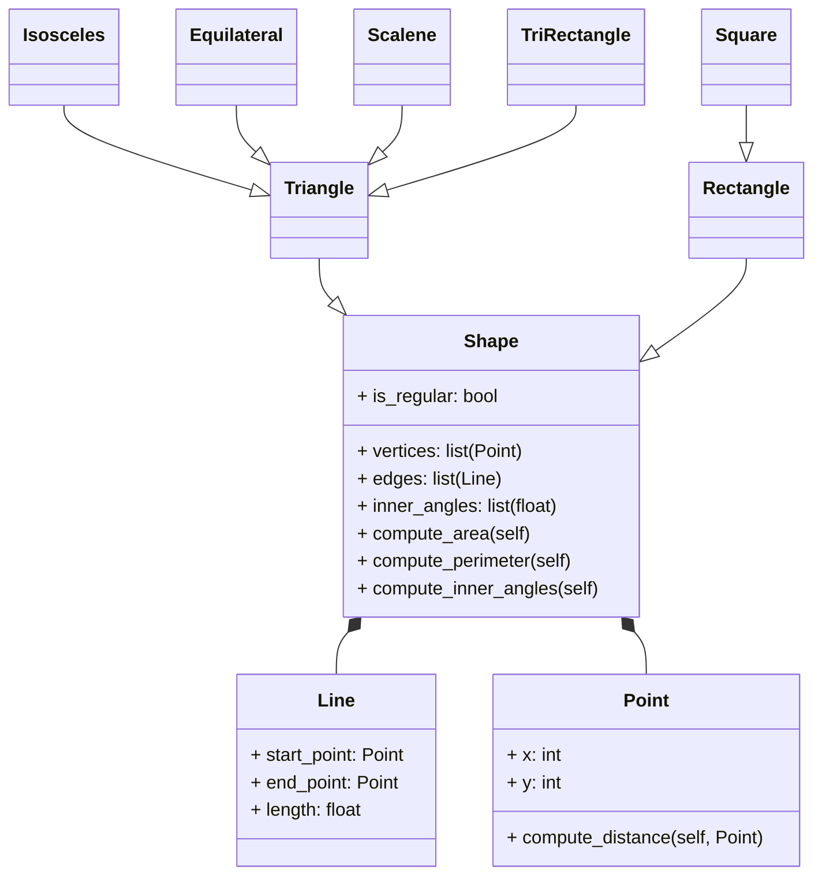

# Challenge #3 POO

### I´m Alejandro Bello Leon from "Fenomenoides" team, i attach our logo: 

<details><summary>Get ready to see the great logo: </summary><p>
<div align='center'>
<figure> </br>
<figcaption><b> "we are programmers, not designers" </b></figcaption></figure>
</div>
</p></details><br>

Below is the solution proposed to the challenge:

#### 1. Excercise proposed in class
1.1. Create a superclass called Shape(), which is the base of the classes Reactangle() and Square(), define the methods compute_area and compute_perimeter in Shape() and then using polymorphism redefine the methods properly in Rectangle and in Square.

```python

import math

class Point:
  def __init__(self, x: float, y: float):
    self.x = x
    self.y = y

class Line:
  def __init__(self, start: Point, end: Point):
    self.start = start
    self.end = end

  def compute_length(self):
    dx = self.start.x - self.end.x
    dy = self.start.y - self.end.y
    return ((dx**2 + dy**2)**0.5)
  
  def compute_slope(self):
    dx = abs(self.start.x - self.end.x)
    dy = abs(self.start.y - self.end.y)
    return(f"The slope of the line with the x axis is {math.degrees(math.atan2(dy, dx))}°")

  def compute_horizontal_cross(self):
    point1 = self.start.y
    point2 = self.end.y
    return(f"Cross with x axis: {point1 * point2 < 0}")  
    
  def compute_vertical_cross(self):
    point1 = self.start.x
    point2 = self.end.x
    return(f"cross with y axis: {point1 * point2 < 0}")
  
  def dicretize_line(self, size):
    points = []
    scalex = 0
    scaley = 0
    dx = (self.end.x - self.start.x) / (size)
    dy = (self.end.y - self.start.y) / (size)
    for i in range(size):
      scalex += dx
      scaley += dy
      points.append((self.end.x - scalex, self.end.y - scaley))
    return points

class Shape:
  def __init__(self):
    pass

  def compute_area(self):
    ...
  
  def compute_perimeter(self):
    ...

class Rectangle(Shape):
  def __init__(self, width1: Line, height1: Line, width2: Line, height2: Line):
    super().__init__()
    self.width1 = width1
    self.height1 = height1
    self.width2 = width2
    self.height2 = height2

  def compute_area(self):
    return self.width1.compute_length() * self.height1.compute_length()
  
  def compute_perimeter(self):
    return (2 * self.height1.compute_length()) + (2 * self.width1.compute_length())
  
class Square(Shape):
  def __init__(self, width1: Line, height1: Line, width2: Line, height2: Line):
    super().__init__()
    self.width1 = width1
    self.height1 = height1
    self.width2 = width2
    self.height2 = height2
  
  def compute_area(self):
    return self.width1.compute_length() ** 2 
  
  def compute_perimeter(self):
    return 4 * self.width1.compute_length()

```

Then, the exampĺe in the main:

```python

if __name__ == "__main__":

  #* RECTANGLE
  # First Line
  start1 = Point(0,0)
  end1 = Point(0,5)
  line1 = Line(start1, end1)

  # Second line
  start2 = Point(0,0)
  end2 = Point(4,0)
  line2 = Line(start2, end2)

  # Third line
  start3 = Point(4,0)
  end3 = Point(4,5)
  line3 = Line(start3, end3)

  # fourth line
  start4 = Point(0,5)
  end4 = Point(4,5)
  line4 = Line(start4, end4)

  rectangle1 = Rectangle(line1, line2, line3, line4)
  print(rectangle1.compute_area())
  print(rectangle1.compute_perimeter())  
  
  
  #* SQUARE
  # First Line
  start1 = Point(0,0)
  end1 = Point(0,5)
  line1 = Line(start1, end1)

  # Second line
  start2 = Point(0,0)
  end2 = Point(5,0)
  line2 = Line(start2, end2)

  # Third line
  start3 = Point(5,0)
  end3 = Point(5,5)
  line3 = Line(start3, end3)

  # fourth line
  start4 = Point(0,5)
  end4 = Point(5,5)
  line4 = Line(start4, end4)

  square1 = Square(line1, line2, line3, line4)
  print(square1.compute_area())
  print(square1.compute_perimeter())
```

1.2. Using the classes Point() and Line() define a new super-class Shape() with the following structure:



Using the builded class `Point` and `Line`, i constructed the superclass `Shape`; inheriting the types of triangles and rectangles:

```python
import math

class Point:
  def __init__(self, x: float, y: float):
    self.x = x
    self.y = y

class Line:
  def __init__(self, start: Point, end: Point):
    self.start = start
    self.end = end

  def compute_length(self):
    dx = self.start.x - self.end.x
    dy = self.start.y - self.end.y
    return ((dx**2 + dy**2)**0.5)
  
  def compute_slope(self):
    dx = abs(self.start.x - self.end.x)
    dy = abs(self.start.y - self.end.y)
    return(f"The slope of the line with the x axis is {math.degrees(math.atan2(dy, dx))}°")

  def compute_horizontal_cross(self):
    point1 = self.start.y
    point2 = self.end.y
    return(f"Cross with x axis: {point1 * point2 < 0}")  
    
  def compute_vertical_cross(self):
    point1 = self.start.x
    point2 = self.end.x
    return(f"cross with y axis: {point1 * point2 < 0}")
  
  def dicretize_line(self, size):
    points = []
    scalex = 0
    scaley = 0
    dx = (self.end.x - self.start.x) / (size)
    dy = (self.end.y - self.start.y) / (size)
    for i in range(size):
      scalex += dx
      scaley += dy
      points.append((self.end.x - scalex, self.end.y - scaley))
    return points

class Shape:
  def __init__(self):
    pass

  def compute_area(self):
    ...
  
  def compute_perimeter(self):
    ...

class Rectangle(Shape):
  def __init__(self, width1: Line, height1: Line, width2: Line, height2: Line):
    super().__init__()
    self.width1 = width1
    self.height1 = height1
    self.width2 = width2
    self.height2 = height2

  def compute_area(self):
    return self.width1.compute_length() * self.height1.compute_length()
  
  def compute_perimeter(self):
    return (2 * self.height1.compute_length()) + (2 * self.width1.compute_length())
  
class Square(Shape):
  def __init__(self, width1: Line, height1: Line, width2: Line, height2: Line):
    super().__init__()
    self.width1 = width1
    self.height1 = height1
    self.width2 = width2
    self.height2 = height2
  
  def compute_area(self):
    return self.width1.compute_length() ** 2 
  
  def compute_perimeter(self):
    return 4 * self.width1.compute_length()
  
class Triangle(Shape):
  def __init__(self, side1: Line, side2: Line, side3: Line):
    super().__init__()
    self.side1 = side1
    self.side2 = side2
    self.side3 = side3

  def compute_area(self):
    ...
  
  def compute_perimeter(self):
    ...

class IsocelesTriangle(Triangle):
  def __init__(self, base: Line, height: Line, side1: Line, side2: Line):
    super().__init__(side1, side2, height)
    self.base = base
    self.height = height

  def compute_area(self):
    return (self.base.compute_length() * self.height.compute_length()) / 2
  
  def compute_perimeter(self):
    return self.base.compute_length() + (2 * self.side1.compute_length())

class EquilateralTriangle(Triangle):
  def __init__(self, side1: Line, side2: Line, side3: Line):
    super().__init__(side1, side2, side3)

  def compute_area(self):
    return (self.side1.compute_length() ** 2 * (3 ** 0.5)) / 4
  
  def compute_perimeter(self):
    return 3 * self.side1.compute_length()
  
class RectangleTriangle(Triangle):
  def __init__(self, side1: Line, side2: Line, side3: Line):
    super().__init__(side1, side2, side3)

  def compute_area(self):
    return (self.side1.compute_length() * self.side2.compute_length()) / 2
  
  def compute_perimeter(self):
    return self.side1.compute_length() + self.side2.compute_length() + self.side3.compute_length()
  
class ScaleneTriangle(Triangle):
  def __init__(self, side1: Line, side2: Line, side3: Line):
    super().__init__(side1, side2, side3)

  def compute_area(self):
    s = (self.side1.compute_length() + self.side2.compute_length() + self.side3.compute_length()) / 2
    return (s * (s - self.side1.compute_length()) * (s - self.side2.compute_length()) * (s - self.side3.compute_length())) ** 0.5
  
  def compute_perimeter(self):
    return self.side1.compute_length() + self.side2.compute_length() + self.side3.compute_length()
```

the usage example:

```python
if __name__ == "__main__":
  #* RECTANGLE
  start1 = Point(0, 0)
  end1 = Point(0, 5)
  line1 = Line(start1, end1)
  start2 = Point(0, 0)
  end2 = Point(4, 0)
  line2 = Line(start2, end2)
  start3 = Point(4, 0)
  end3 = Point(4, 5)
  line3 = Line(start3, end3)
  start4 = Point(0, 5)
  end4 = Point(4, 5)
  line4 = Line(start4, end4)
  rectangle1 = Rectangle(line1, line2, line3, line4)
  print("Área del rectángulo:", rectangle1.compute_area())
  print("Perímetro del rectángulo:", rectangle1.compute_perimeter())

  #* SQUARE
  start1 = Point(0, 0)
  end1 = Point(0, 5)
  line1 = Line(start1, end1)
  start2 = Point(0, 0)
  end2 = Point(5, 0)
  line2 = Line(start2, end2)
  start3 = Point(5, 0)
  end3 = Point(5, 5)
  line3 = Line(start3, end3)
  start4 = Point(0, 5)
  end4 = Point(5, 5)
  line4 = Line(start4, end4)
  square1 = Square(line1, line2, line3, line4)
  print("Área del cuadrado:", square1.compute_area())
  print("Perímetro del cuadrado:", square1.compute_perimeter())

  #* ISOSCELES TRIANGLE
  base = Line(Point(-2, 0), Point(2, 0))
  side1 = Line(Point(-2, 0), Point(0, 3))
  side2 = Line(Point(2, 0), Point(0, 3))
  height = Line(Point(0, 3), Point(0, 0))  # Altura perpendicular
  isosceles_triangle = IsocelesTriangle(base, height, side1, side2)
  print("Área del triángulo isósceles:", isosceles_triangle.compute_area())
  print("Perímetro del triángulo isósceles:", isosceles_triangle.compute_perimeter())

  #* EQUILATERAL TRIANGLE
  side1 = Line(Point(0, 0), Point(3, 0))
  side2 = Line(Point(3, 0), Point(1.5, 2.598))
  side3 = Line(Point(1.5, 2.598), Point(0, 0))
  equilateral_triangle = EquilateralTriangle(side1, side2, side3)
  print("Área del triángulo equilátero:", equilateral_triangle.compute_area())
  print("Perímetro del triángulo equilátero:", equilateral_triangle.compute_perimeter())

  #* RECTANGLE TRIANGLE
  side1 = Line(Point(0, 0), Point(3, 0))  # Base
  side2 = Line(Point(3, 0), Point(3, 4))  # Altura
  side3 = Line(Point(0, 0), Point(3, 4))  # Hipotenusa
  rectangle_triangle = RectangleTriangle(side1, side2, side3)
  print("Área del triángulo rectángulo:", rectangle_triangle.compute_area())
  print("Perímetro del triángulo rectángulo:", rectangle_triangle.compute_perimeter())

  #* SCALENE TRIANGLE
  side1 = Line(Point(0, 0), Point(3, 0))
  side2 = Line(Point(3, 0), Point(2, 4))
  side3 = Line(Point(2, 4), Point(0, 0))
  scalene_triangle = ScaleneTriangle(side1, side2, side3)
  print("Área del triángulo escaleno:", scalene_triangle.compute_area())
  print("Perímetro del triángulo escaleno:", scalene_triangle.compute_perimeter())
```
#### 2. The restaurant revisted
